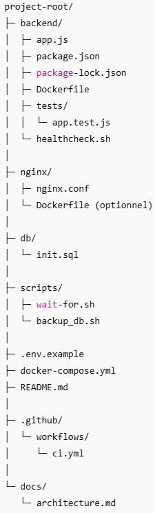

# Virtualisation d'une application avec des conteneurs
## 1 Introduction
### Sujet
Stack Web + DB avec Docker Compose

### But
Conteneuriser une application web composée de plusieurs services frontend et backend.

### Stack technique
Frontend : Nginx\
Backend : Node.js\
Base de données: MySQL\
Orchestration : Docker & Docker Compose

## 2 Structure du projet


## 3 Installation et configuration
### Prérequis
- Docker et Docker Compose installés
- Node.js
- MySQL client
- Variables d'environnement (voir le fichier ".env")

## 4 Lancer l'application
1. Cloner le repo 
$ git clone https://github.com/akrblt/Project_347_Docker.git
$ cd Project_347_Docker

2. Copier .env.example en .env et remplir les variables
3. Lancer le conteneur $ docker-compose up --build

4. Accéder à l'app :
https://localhost:8080

## 5. Frontend (Nginx)
### Description

Le service frontend utilise Nginx pour :

- Servir le fichier index.html (interface utilisateur).

- Rediriger les appels API vers le backend Node.js via un proxy inverse.

- Fournir un point d’entrée unique à l’application web.

### Rôle

- Fournit le contenu statique du dossier /usr/share/nginx/html.

- Transmet les requêtes REST (/items, /health, etc.) au backend via le reverse proxy.

### index.html
- HTML + CSS natifs (mise en page simple)
- JavaScript Vanilla (pur) pour communiquer avec une API REST

## 6 Backend
### Description
- API REST construite avec Node.js et Express
- Intéraction avec la base MySQL via le module mysql2/promise
- Gère une table items avec des opérations simples de lecture et d'ajout
  
### Variables d'environnement
#### Variable	    Défaut	    Description
MYSQL_HOST	    db	        Hôte du serveur MySQL\
MYSQL_USER	    appuser	    Utilisateur MySQL\
MYSQL_PASSWORD	apppass	    Mot de passe MySQL\
MYSQL_DATABASE	appdb	    Nom de la base\
PORT	        5000    	Port d’écoute du backend\

## 7 Base de données (MySQL)

### Description : 
Le projet utilise MySQL comme base de données relationnelle pour stocker les données de l’application, notamment la table `items` gérée par le backend. La base est contenue dans un service Docker séparé et communique avec le backend via un réseau interne défini dans `docker-compose.yml`.

### Configuration : 
  #### Nom du conteneur : `db`  
  #### Port interne : 3306 (accessible uniquement depuis les autres services Docker)  
  #### Utilisateur : `appuser`  
  #### Mot de passe : `apppass`  
  #### Nom de la base de données : `appdb`  


## 8 Tests


### Objectif :
Vérifier que les différents services (frontend, backend, base de données) fonctionnent correctement et que l’API REST répond comme attendu.

### Tests manuels :  
#### 1.Vérification du backend :
   - Lancer le conteneur backend :  
     ```bash
     docker-compose up backend
     ```
   - Tester l’API REST avec `curl` ou Postman :  
     ```bash
     curl http://localhost:5000/items
     ```
     - Doit retourner une liste JSON des items (vide si aucun item n’a été ajouté).  
   - Ajouter un nouvel item :  
     ```bash
     curl -X POST http://localhost:5000/items -H "Content-Type: application/json" -d '{"name":"Item1","description":"Test"}'
     ```

#### 2. Vérification de la base de données :
   - Se connecter au conteneur MySQL :  
     ```bash
     docker exec -it db mysql -u appuser -p
     ```
     - Mot de passe : `apppass`  
     - Vérifier la table `items` :  
       ```sql
       USE appdb;
       SELECT * FROM items;
       ```

#### 3. Vérification du frontend :
   - Accéder à `https://localhost:8080`  
   - Vérifier que la page charge et que les opérations de lecture/ajout d’items fonctionnent correctement.

#### Tests automatisés (optionnel) :  
- Backend : tests unitaires avec Jest (Node.js) ou Pytest (si Flask).  
- Script : exécuter `npm test` pour lancer les tests.


# 9 Déploiment, versionning et contribution
- Déploiment avec Docker Compose
- Intégration continue via GitHub
- Convention de commits
- Branches principales : main et develop
- Branches feature pour test : "merge-test" et "solution_nodejs_complete"
